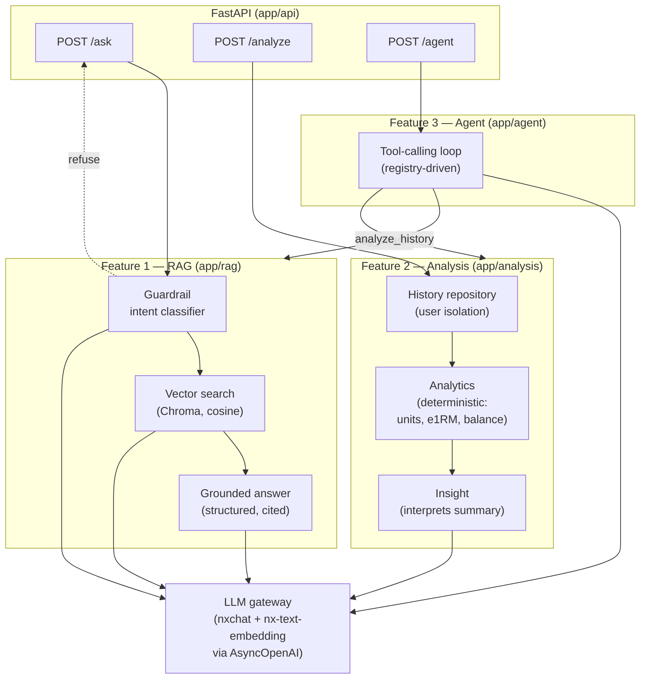

# AI Workout Coach

Everfit AI Engineer take-home. An assistant that answers fitness questions from a
knowledge base, analyses a user's training history, and helps coaches with
multi-step questions through a tool-calling agent — with guardrails for a
health-adjacent context.

All four features are implemented, tested (59 tests), and evaluated
(`EVALUATION.md`). Runs with a single `docker compose up`.

## Time estimate

Stated before starting: **9–11 hours**, against the brief's 6–8. The delta is
deliberate — Feature 4 (evaluation + honest failure analysis) and the three
required documents are graded as heavily as the pipeline code, and the brief
weights AI-adoption evidence equally with technical output.

## Stack

| Concern | Choice | Why |
|---|---|---|
| API | FastAPI | Async-native (the gateway client is `AsyncOpenAI`), typed request/response models via Pydantic, free OpenAPI docs |
| LLM | `nxchat` via `https://api.ntq.ai/v1` | Project-provided gateway; OpenAI-compatible, so accessed with the official `openai` SDK rather than raw HTTP |
| Embeddings | `nx-text-embedding` (1024-dim) | Same gateway — no second credential, no local model weights in the image |
| Vector DB | Chroma (persistent, local) | Embedded — no extra service in `docker-compose`, which keeps `docker compose up` a single command. At ~100 chunks the scaling ceiling is irrelevant |
| Deploy | `docker compose up` | Single command, as preferred by the brief |

Gateway capabilities were **verified by probe**, not assumed — native
tool-calling, parallel tool-calling, and strict `json_schema` structured outputs
all work. See `AI_WORKFLOW.md`.

## Architecture



**The consistent shape:** a deterministic layer does the work that must be
correct (retrieval, unit-normalised stats, tool dispatch), and the LLM is used
only where judgement is needed (grounded phrasing, interpretation, tool
selection). The agent reuses Features 1 and 2 as tools rather than
reimplementing them — including Feature 1's guardrail, so unsafe agent
sub-queries are refused the same way a direct `/ask` is.

## Setup

```bash
cp src/.env.samples src/.env   # then fill in LLM_API_KEY
docker compose up --build
curl localhost:8000/health
```

Local development without Docker:

```bash
python3 -m venv .venv && .venv/bin/pip install -r requirements.txt
PYTHONPATH=src .venv/bin/uvicorn app.main:app --reload
```

API keys are read from the environment only — never hardcoded. `src/.env` is
gitignored.

## Layout

```
src/app/
  config.py           # env-driven settings (pydantic-settings)
  main.py             # FastAPI entrypoint
  llm/client.py       # async gateway wrapper + token/cost accounting
  rag/                # Feature 1: chunking, store, ingest, grounded answers
  guardrail/          # safety intent classifier
  analysis/           # Feature 2: taxonomy, analytics, insight, user repository
  api/                # routes + request/response schemas
knowledge-base/       # 20 markdown fitness documents
sample-data/          # 3 months of workout history for 2 users
```

## Endpoints

| Endpoint | Feature | Purpose |
|---|---|---|
| `POST /ask` | 1 | Answer a fitness question from the knowledge base, with citations. Refuses out-of-scope and medical-advice questions. |
| `POST /analyze` | 2 | Analyse a user's workout history (`user_id` or inline `workouts`) and answer a question about it, backed by computed stats. |
| `POST /agent` | 3 | Answer a multi-step coaching question by deciding which tools to call (`rag_search`, `analyze_history`) and in what order. |
| `GET /health` | — | Liveness + indexed-chunk count. |

Interactive API docs at `/docs` when the server is running.

## Documents

- [`AI_WORKFLOW.md`](AI_WORKFLOW.md) — how AI tools were used, what they got wrong, and how it was corrected
- [`docs/GUARDRAILS.md`](docs/GUARDRAILS.md) — safety refusal strategy: triggers, messages, and how over-restriction is avoided
- [`EVALUATION.md`](EVALUATION.md) — 15-case test set, metric results, and failure analysis
- [`docs/METERING.md`](docs/METERING.md) — bonus: how per-query billing would be added

## Coach-assist agent (Feature 3)

A registry-driven tool-calling loop over `rag_search` (Feature 1) and
`analyze_history` (Feature 2). No agent framework: for two tools and one level of
delegation, native function-calling via the gateway is enough and keeps the
reasoning visible. Native + parallel tool-calling was verified against the
gateway before building (see `AI_WORKFLOW.md`). The loop is tool-agnostic — it
asks the model which tools to call, executes them from the registry, feeds
results back, and repeats until the model stops or the iteration cap is hit. It
does not hardcode the call order.

The three questions the brief asks about the agent:

**What happens if the agent calls the wrong tool first?** Nothing breaks. Every
tool result is fed back into the conversation, so if the model calls the wrong
tool it sees a result that doesn't answer the question and re-plans on the next
iteration — the loop working as designed, not a failure. A tool that finds no
usable data returns an explicit `status` (`unknown_user`, `insufficient_data`)
rather than an empty result, so the model is told what went wrong instead of
inferring an answer from nothing.

**How would you add a third tool without rewriting the agent logic?** Register
one more `Tool` (name, function schema, async callable) in `build_registry`. The
loop iterates the registry and dispatches by name, so it needs zero changes — it
never references a specific tool. That is the reason the registry exists.

**What's the failure mode you're most worried about in production?** Not wrong
tool selection — that self-corrects. It's a tool returning *plausible but
insufficient* data that the model treats as sufficient: `analyze_history` on a
user with two sessions returns real-looking numbers, and the model gives
confident advice on a weak signal. The mitigation is the explicit-status contract
at the tool boundary (`insufficient_data` is a distinct status the prompt is told
to respect), but a determined model can still over-read thin data. This is the
same class of risk flagged for Feature 2 in `EVALUATION.md`.

## Cost per query

Every gateway call threads a `Usage` accumulator, so these are **measured token
counts**, not estimates. The gateway publishes no pricing, so per-token rates
assume OpenAI's small-model tier (`gpt-4o-mini`: $0.15/1M input, $0.60/1M output;
`text-embedding-3-small`: $0.02/1M) — declared as constants in `config.py`, so
one edit re-prices everything.

| Feature | Avg tokens (in / out / embed) | LLM calls | Cost/query | At 1,000/day |
|---|---|---|---|---|
| Feature 1 `/ask` | ~1030 / 190 / 11 | 2 (guardrail + answer) | **$0.00027** | **~$0.27/day** |
| Feature 2 `/analyze` | ~1990 / 285 / 0 | 1 (insight; stats are deterministic) | **$0.00047** | **~$0.47/day** |

Combined, both features at 1,000 queries/day each is **well under $1/day** at
this tier. (`/agent` is higher — 2 planning calls plus the tool sub-calls it
triggers, ~$0.002/query — but the brief asks specifically about Features 1 and 2.)

**What I'd optimise first:** the guardrail adds a classification call to every
`/ask`. It runs concurrently with the embedding so it costs no latency, but it is
~15% of Feature 1's tokens. The measured, honest options (analysed in
`AI_WORKFLOW.md`): fold safety into the answer call (one call instead of two), or
cascade — a free embedding-based pre-filter that only escalates ambiguous cases
to the LLM. Feature 2's larger input is the computed summary; trimming it to only
the exercises a question references would cut its input tokens materially.

## Production thinking

- **Error handling** — upstream gateway failures return `502` with a generic
  message (internals never leak); unknown users `404`; bad requests `400`;
  malformed model output degrades to a safe fallback rather than a `500`.
- **Data isolation** — enforced structurally: the history repository exposes only
  `get(user_id)` and has no bulk accessor, so one user's data cannot reach
  another's context. Tested directly.
- **Cost/latency awareness** — usage is measured per request and returned in every
  response; the guardrail is run concurrently with embedding to hide its latency.
- **Logging** — structured, with third-party clients quieted so request bodies and
  prompts aren't echoed to stdout at `LOG_LEVEL=debug`.
- **Determinism where it matters** — units, e1RM, balance, and tool dispatch are
  pure Python and unit-tested; the LLM never does arithmetic.

## Design decisions & tradeoffs

- **No agent framework (justified).** For two tools and one level of delegation, a
  native function-calling loop is ~120 lines and keeps the tool-selection
  reasoning visible. Frameworks (LangGraph, LangChain v1's `create_agent` +
  middleware, PocketFlow) earn their weight on capabilities this system doesn't
  have yet — streaming to a UI, multi-turn persistence, write-tool approval gates,
  multi-agent orchestration. Notably, the guardrail-before-answer and tool-status
  hooks I hand-built map cleanly onto LangChain middleware — a sign the seams are
  right and the design is straightforward to lift into a framework later.
- **Retrieval is plain top-k.** Per-document capping and MMR were both measured and
  rejected — neither can read query intent, which is the signal that actually
  separates a broad deep-dive from a multi-topic question. See `EVALUATION.md` and
  `AI_WORKFLOW.md`.
- **Safety is a separate intent classifier, not the relevance threshold.** A
  medical question is topically in-scope, so similarity cannot catch it. See
  `docs/GUARDRAILS.md`.
- **Analysis pre-processes before the LLM.** Only a computed summary reaches the
  model, never raw sets — the brief's core requirement for Feature 2, and it makes
  a rule-based grounding metric possible.

## Testing

```bash
PYTHONPATH=src .venv/bin/python -m pytest        # 59 tests, no network required
PYTHONPATH=src .venv/bin/python scripts/evaluate.py   # full eval against live gateway
```
